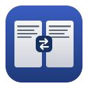

# RemoteDeskRDP

<p align="center">
  
</p>

[](https://github.com/nojan01/RemoteDeskRDP/releases/latest)
[](LICENSE)
[](https://www.apple.com/macos/)

RemoteDeskRDP is a native, open-source connection manager for macOS. It keeps
RDP, VNC, SSH, SFTP and Mosh profiles in one place and also provides direct
access to S3-compatible and OpenStack Swift object storage.

The interface is available in German and English. Credentials stay in the
macOS Keychain; profile files never contain passwords.

## Highlights

- Self-contained RDP client based on a patched FreeRDP build; no Homebrew or
  XQuartz runtime is required for RDP.
- Integrated VNC viewer and SSH terminal, plus SFTP and optional Mosh support.
- RD Gateway, dynamic resolution, clipboard and file transfer, folder, printer
  and smartcard redirection, audio and H.264 video acceleration.
- Drag and drop between Finder and compatible RDP sessions.
- Profile-based connections with certificate-change warnings and automatic
  reconnect support.
- Native light/dark appearance and German/English localization.

## Download

Download the signed and notarized DMG from the
[latest GitHub release](https://github.com/nojan01/RemoteDeskRDP/releases/latest).
The current release targets Apple Silicon and requires macOS 26.0 or newer.

## Data and security

The app keeps connection profiles in `~/Library/Application Support/RemoteDesk`
and leaves credentials to the macOS Keychain. That directory name predates the
rename to RemoteDeskRDP and stays unchanged so existing profiles remain usable.

RemoteDeskRDP asks before accepting changed server certificates. As with any
remote access client, review the target and certificate details before
connecting and do not enable certificate bypasses without understanding the
risk.

For architecture and integration details, see the
[technical specification](docs/REMOTE_CLIENT.md). The complete bundled FreeRDP
and SDL changes are documented in [FREERDP_PATCHES.md](docs/FREERDP_PATCHES.md).

## Development

Requirements: Node.js 20 or newer, the Rust toolchain and Xcode Command Line
Tools.

```sh
npm ci
npm run tauri:dev
```

## Release backend

Release bundles include a universal, self-contained `MacFreeRDP.app`; end users
do not need Homebrew, XQuartz or any other RDP runtime. Build it once before a
release:

```sh
npm run build:rdp-backend
npm run tauri:build
```

`tauri:build` refuses to create a distributable without the bundled backend.
The development app can still use a locally built backend through
`REMOTEDESK_RDP_EXECUTABLE`.

The bundled FreeRDP is patched: upstream's SDL client presents a frame for every
update packet it receives, and every present waits for the display refresh, so a
single screen update could stall for hundreds of milliseconds. The patch
collects all pending packets and presents once.

RDP sessions use the bundled SDL client, which is the only backend that speaks
the Display Control channel and can therefore follow the window with a real
resolution change. Its Metal renderer blocks in `[CAMetalLayer nextDrawable]` on
macOS and freezes the session, so RemoteDeskRDP always starts it with the OpenGL
renderer. The bundled native Cocoa client (`MacFreeRDP`) is the fallback; it can
only scale the image. `REMOTEDESK_RDP_EXECUTABLE` wins over everything else;
after that RemoteDeskRDP falls back to the bundled `sdl-freerdp`, the bundled
`MacFreeRDP`, a Homebrew `sdl-freerdp` and finally to `xfreerdp` with XQuartz.

## Window size and resolution

Every profile stores how its session window behaves:

| Setting | Effect |
|---|---|
| Fenster | Starts with the configured `width` × `height` (`/size:`) |
| Nutzbare Bildschirmfläche | Fills the usable screen area (`+workarea`) |
| Vollbild | Full screen, `⌃⌥⏎` toggles back (`+f`) |
| Auflösung mitziehen | `+dynamic-resolution`, the server follows the window size |
| Bild skalieren | `/smart-sizing`, the window is always resizable |
| Feste Auflösung | Neither option, the window stays fixed |

The colour depth is passed as `/bpp`. FreeRDP only accepts 32, 24, 16, 15 and 8
bits and rejects anything else, so the profile offers exactly those. Leaving it
on automatic omits the option and lets client and server negotiate.

## Folder sharing

Any number of local folders can be handed to the session. Each one is passed as
`/drive:name,path` and shows up among the redirected drives in the guest. The
name defaults to the folder name and must not contain a comma — FreeRDP uses it
to separate name and path and offers no escaping, so RemoteDeskRDP refuses such
entries instead of silently creating a wrong share.

## Clipboard

Sharing the clipboard in both directions requires `+clipboard`. macOS has no
event for pasteboard changes, so SDL compares the pasteboard's `changeCount`.
Upstream it only did so when the window gained focus, which meant anything
copied elsewhere never reached the session while the RDP window kept focus. The
bundled SDL patch also checks from the event loop, throttled to at most every
250 ms so the render path stays untouched.

### Copying files

Files copied on the Mac reach the session as long as the server advertises file
transfer. macOS stores them as `public.file-url`, one entry per file, while
FreeRDP expects `text/uri-list`. The SDL patch assembles that type from every
entry, so a multiple selection is transferred in full. The FreeRDP patch
advertises file support to the server and offers `FileGroupDescriptorW`.

Finder adds a twist: it does not put path URLs on the pasteboard but file
reference URLs of the form `file:///.file/id=6571367.121757495`. Read
literally that yields the path `/.file/id=…`, which does not exist — the
receiver then fails silently in `stat()`, and the guest offers a paste that
does nothing. The SDL patch therefore resolves every file URL to its real path
through `filePathURL`.

Both directions work now, and so does drag and drop (see below). If the server
does not advertise file support, copying stays limited to text and images. With
xrdp this happened when an older session was reused; after logging out inside
the guest the same server offered file transfer again.

### Folders: a server limit, not a client one

Individual files reach every target, folders only reach Windows. Against xrdp
they fail in **both** directions, and the cause is in xrdp itself — see
`sesman/chansrv/clipboard_file.c`:

- Mac to session (`clipboard_c2s_in_files`, line 622): every entry that has
  `CB_FILE_ATTRIBUTE_DIRECTORY` set **or** a backslash in its name is dropped
  with `continue` — "skipping directory not supported".
- Session to Mac (`clipboard_get_file`, line 171): `g_directory_exist()` leads
  to `return 1`, so the folder never enters the list — "is a directory, not
  supported".

For a folder containing a subfolder this discards the **entire** list: the
directory because of its attribute, every file inside it because of the
backslash. The guest receives zero usable entries and reports an empty file name
plus "operation not supported", which is `G_IO_ERROR_NOT_SUPPORTED` in GIO.

Measured and cross-checked: RemoteDeskRDP emits five correct descriptors for a
nested test folder (directories carrying `attr=0x10`, nested paths separated by
backslashes), exactly as MS-RDPECLIP §2.2.5.2.3.1 prescribes, and folders travel
both ways against Windows 11 without a hitch. The client is fine; the limit is
server side and cannot be fixed from here.

For folders on Linux targets use **folder sharing** (`/drive:`), which does not
take this route, or transfer an archive.

#### Special characters in folder names

The file list travels as a URI list, so it is percent-encoded: `My Folder`
becomes `My%20Folder`. FreeRDP decoded that in only one of three places, so the
directory check ran against a name that does not exist on disk. Folders with a
**space, umlaut, `%` or `#`** were therefore not recognised as directories and
travelled without their contents — plain names happened to work by chance. The
FreeRDP patch now decodes exactly once, before anything uses the path (item 10
of the patch).

Two further limits remain:

- **Large files block the paste**, because the incoming direction downloads them
  in full before handing them to Finder.
- **A drag can only start while the mouse button is held**, which is a macOS
  rule rather than a timeout.

FreeRDP rejects `/smart-sizing` together with `+dynamic-resolution`, so
RemoteDeskRDP only ever sends one of them. Dynamic resolution needs the RDP Display
Control channel. The bundled Cocoa client does not implement it, so RemoteDeskRDP
silently falls back to `/smart-sizing` on that backend and the window stays
resizable. Servers without the channel behave the same way — choose scaling
there.

## Gateway (RD Gateway)

An RD Gateway accepts the connection from outside and forwards it inside the
corporate network; RDP is tunnelled over HTTPS, hence the default port 443. The
switch **Über ein Gateway verbinden** turns this into `/gateway:`.

If user, domain and password are left empty, only `g:` is sent — deliberately.
FreeRDP then sets `GatewayUseSameCredentials = TRUE` in
`parse_gateway_host_option()` and authenticates at the gateway with the session
credentials, which is the common case. As soon as one of the fields is filled,
RemoteDeskRDP sends `u:`/`d:`/`p:` and `parse_gateway_cred_option()` flips that
same flag to FALSE. Sending an empty `u:` would therefore silently disable the
fallback; a test guards against it.

The gateway password lives under its own keychain service
(`com.nojan.remotedesk.gateway`) next to the session password. The existing
service had to stay untouched — the passwords already stored depend on it.

Deleting a profile also removes both of its keychain entries. That happens only
*after* the profile file has been written successfully: if the write fails, the
profile survives and keeps its password. A missing entry is not treated as an
error — a profile without a gateway password is the normal case, and a second
delete must not trip over it.

### Why the values are escaped

`/gateway:` is split on commas, and only afterwards does `unescape()`
(`client/common/cmdline.c`) remove the escapes. Measured against the built
binary:

| Password input | Result |
|---|---|
| `ge,heim` | `Command line parsing failed` |
| `ge\,heim` | accepted |
| `ge"heim` | **gateway silently dropped** |
| `ge\"heim` | accepted |
| `ge\heim` | accepted, but the backslash disappears |

The third case is the dangerous one: splitting aborts at the quote,
`parse_gateway_options()` bails out at `if (count == 0) return TRUE;`, and the
connection goes **directly** to the target instead of through the gateway. It
shows in the error: `CONNECT_FAILED` for the target address instead of
`DNS_NAME_NOT_FOUND` for the gateway name.

`escape_gateway_value()` therefore escapes backslash, comma and both quote
characters. A Rust test reimplements FreeRDP's `unescape()` and asserts the round
trip restores the original; on top of that, an argument produced by the app
containing all four characters was checked against the real binary.

Transport selection (`type:rpc|http|arm`) and Azure Virtual Desktop are not
exposed. `auto` covers RPC and HTTP; ARM additionally needs a token URL and
belongs to a different sign-in flow. Kerberos is not built (`WITH_KRB5=OFF`), so
gateway authentication uses NTLM.

## Printer sharing

The profile switch **Drucker freigeben** appends `/printer`. Without a further
argument FreeRDP forwards *every* queue configured in CUPS; there is
deliberately no per-device picker, because a typical workstation only has a
handful of queues anyway.

The prerequisite is already met. The bundled backend is built with
`WITH_CUPS=ON` (`CHANNEL_PRINTER_CLIENT=ON`) and `libfreerdp-client3` links
against `/usr/lib/libcups.2.dylib`, which you can check yourself:

```sh
otool -L …/MacFreeRDP.app/Contents/Frameworks/libfreerdp-client3*.dylib | grep cups
```

No build script change was needed — CMake picks CUPS up from the Xcode SDK on
its own.

Whether a job actually prints is up to the far side: it needs a driver for the
device being announced. FreeRDP passes the CUPS driver name unless one is forced
with `/printer:<name>,<driver>`. The printer list is gathered while the
connection is set up, so later changes only take effect in a new session.

## Smartcards and video playback

Two more profile switches expose channels the backend already ships:

- **Smartcard freigeben** appends `/smartcard`. The channel is built with
  `WITH_PCSC=ON` and `CHANNEL_SMARTCARD=ON`. Unlike on Linux there is no `pcscd`
  to set up: `libwinpr3` loads
  `/System/Library/Frameworks/PCSC.framework/PCSC` at run time via `dlopen`,
  which is also why the library does not show up in `otool -L` — only as a
  string inside the binary.
- **Videowiedergabe beschleunigen** appends `/video` (MS-RDPEVOR). The server
  may then send video content as an H.264 stream. Decoding is handled by the
  bundled `libopenh264.8.dylib` (`WITH_OPENH264=ON`); `WITH_FFMPEG` is off and
  is not needed for this.

### Why there is no webcam redirection

The channel for it, MS-RDPECAM, is present but only as the server half:
`CHANNEL_RDPECAM_CLIENT:BOOL=OFF`. There is a concrete reason for that — FreeRDP
ships exactly one backend under `channels/rdpecam/client/`, namely `v4l`
(Video4Linux). No AVFoundation backend exists, so on macOS the channel would
have nothing to drive.

The detour through USB redirection (`/usb:id,dev:<vid>:<pid>`) is built —
`CHANNEL_URBDRC=ON`, `libusb-1.0.dylib` sits in the bundle — but rarely works
for cameras: macOS claims USB Video Class devices exclusively through
CoreMediaIO, and libusb cannot easily take them away from the system driver.
That is why there is deliberately no switch for it.

Note that `/video` is **not** camera redirection despite the name. It only
speeds up video that is played back inside the guest.

## Appearance and language

Two small switches sit at the bottom of the sidebar.

**Theme** cycles through `Automatic` (◐), `Light` (☀︎) and `Dark` (☾).
Automatic follows the macOS system setting and reacts to a change while the
app is running, no restart needed.

**Language** cycles through `Automatic` (⚙), `Deutsch` (DE) and `English`
(EN). Automatic follows the system language; anything other than German
results in English.

Both settings apply to the whole app, not per profile, and are stored under
the keys `remotedesk:theme:v1` and `remotedesk:lang:v1` in local storage.

**The session window does not switch along.** It is drawn by FreeRDP and the
guest system – set theme and language inside the guest.

Backend errors follow the language too: the backend no longer returns a
finished sentence but a code such as `err.hostRequired`, which the UI looks
up. An unknown code is shown as-is so a message is never empty.

## Troubleshooting

**Windows reports "Logon failed" even though the credentials are correct.**
Windows rejects network logons with an empty password; the default of
`HKLM\SYSTEM\CurrentControlSet\Control\Lsa\LimitBlankPasswordUse` is `1`. An
account without a password can still sign in locally but never over RDP. Set a
password in the guest. Note that `Get-LocalUser` still reports a
`PasswordLastSet` date in this case — it comes from the installation and proves
nothing. The telling field is `PasswordRequired: False`.

The account also has to be an administrator or a member of *Remote Desktop
Users*.

**The password is requested on every connect.** That prompt comes from FreeRDP
itself and stores nothing. To put the password into the keychain, type it into
the profile's *Passwort* field and press *Speichern*.

**Sessions drop after a minute or two.** Switch on *Reconnect* in the
*Port & network* section (on by default for new and migrated profiles). It sets
FreeRDP's `+auto-reconnect`; without it a single lost beat ends the session for
good, because `AutoReconnectionEnabled` defaults to `FALSE`
(`libfreerdp/core/settings.c:1215`). It only takes effect when the server issued
a reconnect cookie at logon — otherwise it is a no-op.

The most common real cause is a virtual machine the host suspends. In Parallels
the setting is *Pause idle* (Configure ▸ Options ▸ Optimization); during an RDP
session the Parallels window is never in front, so the VM counts as idle and
freezes. Turn it off with
`sudo prlctl set "<VM name>" --pause-idle off`.

### Session logs

Each session records FreeRDP's stderr in
`~/Library/Application Support/RemoteDesk/logs/<profile-id>.log`. The file opens
with the local start time and closes with the backend's exit status — both are
needed to line a message up with `log show`, since FreeRDP's own output carries
no timestamp.

Starting a session does not overwrite the previous log; it shifts it: `…log` →
`…log.1` → … → `…log.5`. After a drop you reconnect immediately, and that used
to delete the very evidence you needed.

The client pins `/log-level:INFO`. Measured, INFO is already FreeRDP's default —
output is identical with and without the switch; pinning only guards against a
later release lowering it. Two INFO lines matter: `Network disconnect!` and
`Attempting reconnect (n of 20)` (`client/common/client.c`). If neither appears,
there was no network drop and no reconnect attempt — half the answer already.

The bracketed prefix is `[PID:thread]`, and it tells you **where** a drop came
from. A line sharing the thread of the connection messages came from the RDP
thread — that is the network. A line sharing the thread of `[handleShow]` came
from the SDL main thread — that is the window being closed.

## License

RemoteDeskRDP's own source code is distributed under the [MIT License](LICENSE).
The app shows the same license under **§ License** in the sidebar below Help.

The bundled third-party components and their licences are listed in
[THIRD_PARTY_LICENSES.md](THIRD_PARTY_LICENSES.md). Those components remain
subject to their respective licenses.

The full licence texts ship inside the app bundle under
`Contents/Resources/resources/freerdp/`.
